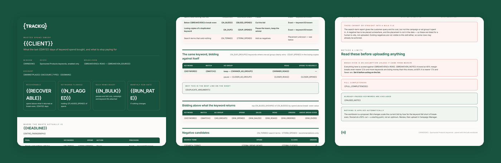

# TrackIQ: Amazon Wasted-Spend Sweeper

Finds the Sponsored Products keyword spend that is not paying for itself, and hands back a bulk-upload workbook with every ID attached and a one-pager explaining the cut.

Run it weekly. The value compounds, because each run reports what the last one recovered.

Part of **Amazon Advertising** in the
[TrackIQ skills catalog](https://github.com/TrackIQ-HQ/amazon-seller-skills).

Built as an [Agent Skill](https://code.claude.com/docs/en/skills). Runs in
Claude Code, Claude web, Claude desktop and ChatGPT from the same folder.

---

## Powered by the TrackIQ MCP

[](https://trackiq.com/mcp)

This skill reads your live Amazon account through the
**[TrackIQ MCP](https://trackiq.com/mcp)** — 16 tools connecting your AI
assistant to Amazon data:

Sales & Traffic · Orders · Inventory · Returns · Sponsored Products · Sponsored
Brands · Sponsored Display · Amazon DSP · AMC Cloud · Keywords · Search Terms ·
Targeting · Search Query Performance · Organic Rank · Best Seller Rank · Buy Box
History · Brand Analytics · Export

Works with Claude, ChatGPT and Cursor. **[Get access →](https://trackiq.com/mcp)**

---

## What you get



Finds Amazon advertising spend that is not paying for itself — keywords that spent and sold nothing, keywords bidding above what they return, the same keyword duplicated across ad groups bidding against itself, and search terms worth negating — then produces an Amazon bulk-operations workbook with the campaign, ad group and keyword IDs already attached, plus a one-page summary of what is being cut and why. Use when the user asks about wasted ad spend, wasted spend, negative keywords, keywords to pause, bid cuts, where money is being lost in PPC, an account cleanup, a PPC audit, or how to lower ACOS.

### The rules that keep it honest

- **Break-even ROAS is an input, not a guess**
- **Only recommend action on `state == 'enabled'`**
- **Rank by spend above break-even value, never by ACOS**
- **Never add the pool subtotals**

The full list is in `SKILL.md`, and each one exists because getting it wrong
produces a confident, wrong answer rather than an obvious error.

## Requirements

- The TrackIQ MCP, for `list_marketplaces`, `get_targets`, `get_ad_groups`, `get_campaigns` and `get_search_terms`. - **A break-even ROAS.** Ask for it before running. It comes from product margin, is not derivable from the MCP, and every verdict depends on it. - `openpyxl` for the workbook, via `assets/build_workbook.py`. Without it, produce the same columns as CSV or a table — the contract is in `assets/method.md`. - **Without the MCP:** works from a Sponsored Products bulk report or the search-term report exported from Campaign Manager, as long as the export carries campaign, ad group and keyword IDs.

---

## Install

### Claude Code

```
/plugin marketplace add TrackIQ-HQ/amazon-seller-skills
/plugin install trackiq-amazon-wasted-spend@trackiq
```

### Claude web, desktop, mobile

1. Download the `.zip` from the
   [latest release](https://github.com/TrackIQ-HQ/trackiq-amazon-wasted-spend/releases)
2. **Settings → Capabilities → Skills** (code execution must be on)
3. **Create skill → Upload a skill**, choose the `.zip`
4. Toggle it on

### ChatGPT

Same zip. **Plugins → Skills → Create → Upload from your computer.**

---

## Setup

Answers live in `account.md`, copied from
[`assets/account.example.md`](skills/trackiq-amazon-wasted-spend/assets/account.example.md).
**Every TrackIQ skill reads the same file**, so an account already set up for
another TrackIQ report needs nothing added.

## Delivery

Asked once and stored in `account.md`: **in-chat** (default), **file**,
**Slack**, **n8n** or **email**. Anything leaving the chat confirms with you
first and falls back to in-chat, with a note.

---

## Customizing

| File | What it controls |
|---|---|
| `build_workbook.py` | the bundled script |
| `checks.md` | the pre-send checks |
| `method.md` | the method and every threshold |
| `pulls.md` | the call sequence and its traps |
| `report-template.html` | the report shell |

---

## Contributing

```bash
python scripts/validate.py    # must exit 0 before any commit
python scripts/build.py       # writes dist/ zip + registry.json
```

Read [AUTHORING.md](https://github.com/TrackIQ-HQ/amazon-seller-skills/blob/main/AUTHORING.md)
before proposing changes.

## License

MIT. See [LICENSE](LICENSE).
